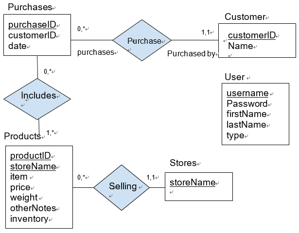

## Diagram:

## Assumptions:
1. Every instance of Stores has a store name
2. Every product has both a productID and storeName and is sold in some store from the Stores table
3. Every purchase has a purchaseID and was bought by one customer with a customerID who is also listed in the Customer table
4. If a customer has multiple purchaseIDs on the same date that must mean they came to the store more than once in a day
5. All users will have a username, password, their name and account type (‘C’ for Customer and ‘S’ for Shop owner). Instances of the User table are independent of other tables because users have to do with the backend access to our application. User type will determine what our website shows. 
6. Customers will only be able to see products in a store and the inventory count
7. Shop owners will be able to see everything in all tables except passwords in the User table
8. Every instance of the Products table will at minimum contain the productID, storeName, item, and inventory
9. If an instance of the Products table doesn’t have a price we assume that the item isn’t for sale and therefore can’t be purchased 
10. If a non-essential row is missing in a table, the value will be NULL

## Description of Relationship and it’s Cardinality:
1. Each customer can make multiple purchases, and each purchase is made by exactly one customer.
2. Each purchase can include one or more products, and each product should be included in zero or more purchases.
3. Every product with a unique combination of productId and storeName should only be sold in that store, and every store can sell more than one product with specific productID and storeName.

## Relational Schema:
Please note that when we have primary keys listed twice in one table, we will combine the two attributes into one primary key

Customer (CustomerID: Int [PK], 
Name:Varchar(100));

Purchases (PurchaseID: int [PK], 
ustomerID: int [FK to Customer.customerID], 
date: DATE);

Includes (PurchaseID: int [PK] [FK to Purchases.PurchaseID],
productID: int [PK] [FK to Products.productID, storeName:varchar(100) [PK] [FK to Stores.storeName]) ;

Products (productID: int [PK],
storeName:varchar(100) [PK] [FK to Stores.storeName], 
item:varchar(100), 
rice:double(10, 2), 
weight:double(10,3), 
otherNotes:varchar(100),
inventory:int);

Stores (storeName:varchar(100) [PK] );

User (username: varchar(100) [PK], 
Password: varchar(100), 
firstName: varchar(100), 
lastName: varchar(100), 
type: char(1));
