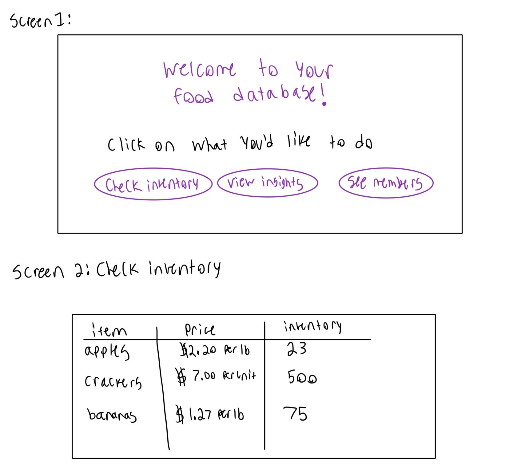
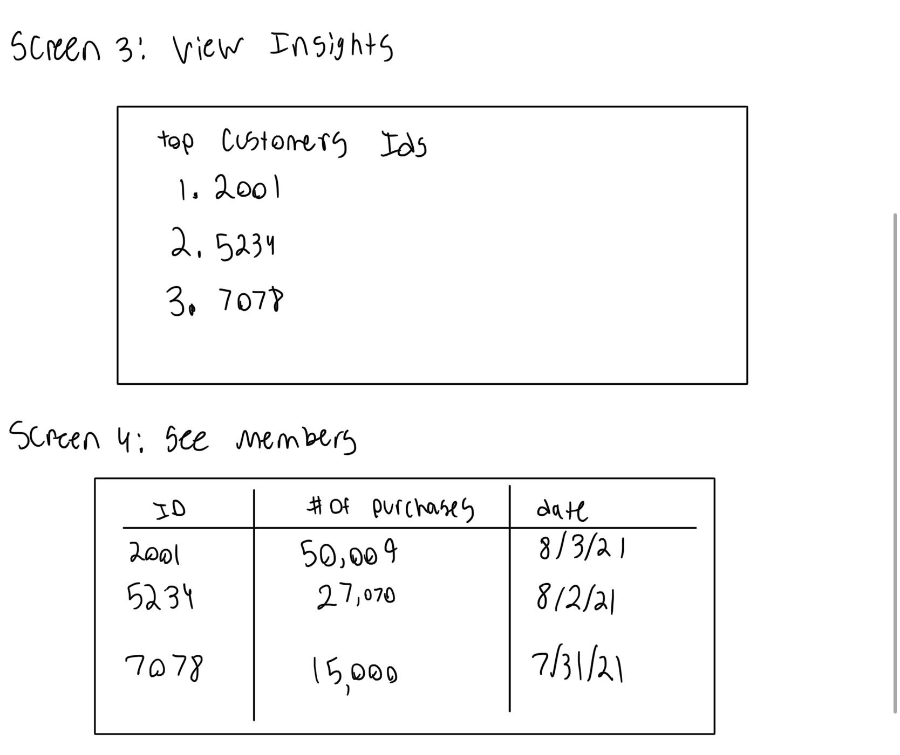

## Project Title: Super Market
By: Jung-Cheng Ho, Yu-Te Kuo, Longping Zhang, Lyla Zegelstein

## Project Summary:
We will create a database of a fictional supermarket consisting of food items, the current inventory, and the price. We will also keep track of user data such as customers and their purchases, the total amount of money the customer has spent at this supermarket and their number of visits. With this information, we will be able to know when it’s time to restock the inventory and know who the big spending customers are.

## Project Detailed Description:
Our application can help the owners of the supermarket know how well their goods are selling in their market, so that they can not only manage their goods and maximize their profits but also satisfy customers’ demands as well. 

For example, if they found apples are the best selling product in their market and bananas are the worst one, they can purchase more apples and fewer bananas to sell to their customers, that way they can enhance their revenue on apples and decrease the loss due to unsellable bananas. Also, the application can let owners know when they will need to replenish their inventory.

## Usefulness:
Our database will give the owner insights on what dates the most purchases happen which will aid them in knowing how much register coverage and inventory they need. 

Similar website:  https://comparegroceryprices.org/search/data/comparison.shtml
The website only displays the product information, but our application will also display customer information. We will try to combine those two pieces of information and provide more insight to the owner.

## Realness:
Our primary dataset will come from https://www.kaggle.com/heeraldedhia/groceries-dataset. We will be able to access this information via a downloadable CSV file which can be easily accessed by our application. 

Our dataset contains member numbers, the date the items were purchased, and the name of the items. We will get the food prices from either https://comparegroceryprices.org/search/data/comparison.shtml  or https://www.ers.usda.gov/data-products/quarterly-food-at-home-price-database/.  

## Description of Functionalities:
Data Stored in the Database:
Our database will store customer Information, product Information, and transaction information. 
 
### Basic Functions:
1. Keep track of the best selling items and send out alerts for when the owner needs more inventory.
2. Gives out discounts or promotion on the least selling items.
3. Manipulate the information in the database, including CREATE, DELETE, UPDATE.
 
### Creative Components:
We can provide different views for the user by utilizing multiple sorting algorithms. This can help the supermarket owner navigate through the data by showing them the information they are looking for. Sorting algorithms may help us sort the table by customer ids, price of the product, etc.
 
### UI mockups: 

## Project Work Distribution:
### Frontend: Jung-Cheng Ho and Longping Zhang
The frontend of our application will be created using React. At least four screens will be designed with screen transitions happening on button presses. Our data will be displayed in a table format for both the Check Inventory and See Members screens. Our view insights screen allows room for more creativity when displaying information like the top spending customers. 

### Backend: Jung-Cheng Ho and Yu-Te Kuo
The backend part of our project will do two parts. First, fetch data from the database and send it to the frontend. Second, we will update the database with changed information from the frontend part.

### Database: Lyla and Yu-Te Kuo
The database of our application will consist of at least three relations, including customer information, product information, and transaction information. 

### Processing Data: Lyla and Longping Zhang
In this stage of the project, data will be read-in from the CSV files and entered into the database if it’s a fit. One example of data we would throw away is an item that isn’t sold in our store. Another piece of unfit data would be prices of items missing. Our data is also subject to change when items are bought or sold and will require updating functionalities. 